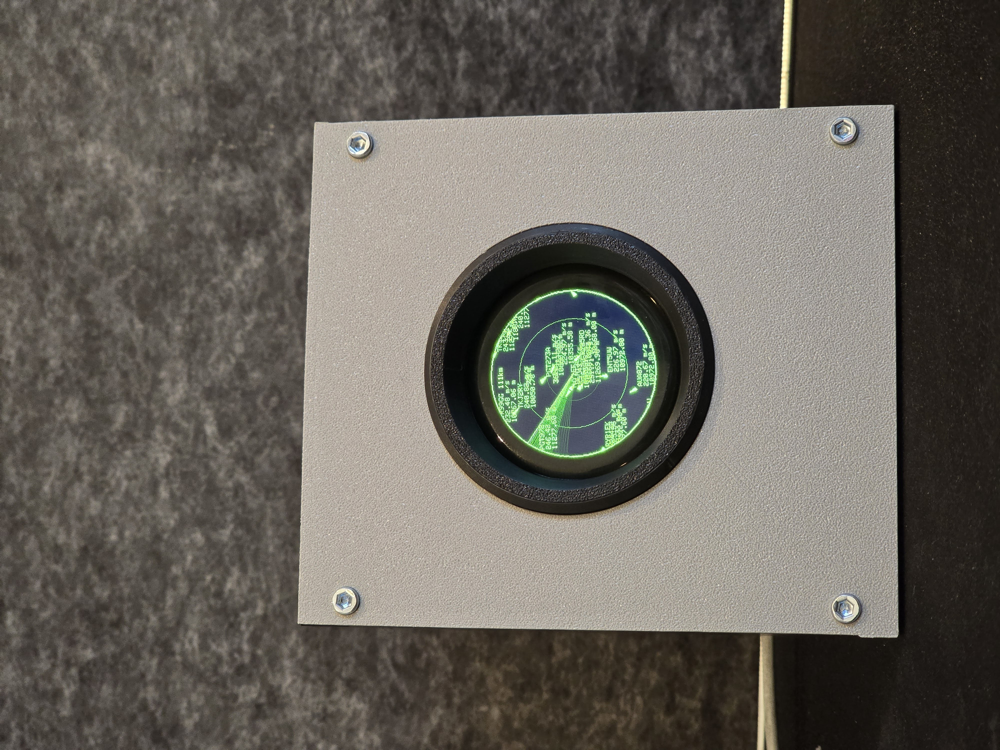
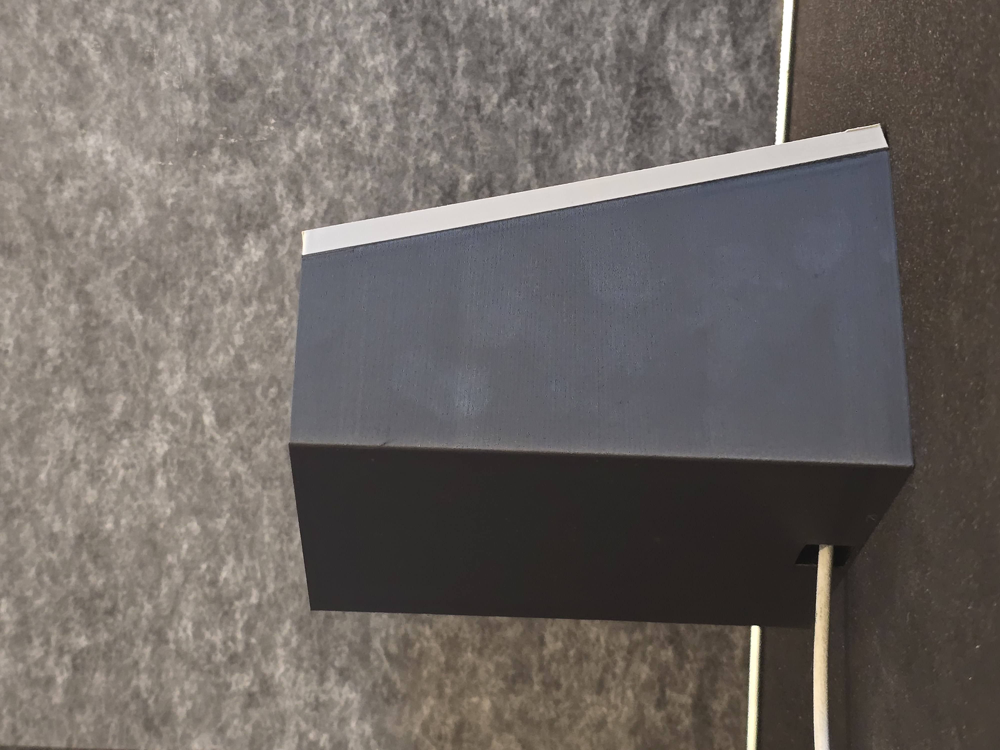

<h1 align=center>
  📡 Micro Radar (Touch Edition)
</h1>
<h6 align=center>
  a tiny open-source flight radar for your desk — now with a touchscreen
</h6>

  
  

  <a href="#hardware">HARDWARE</a> - <a href="#features">FEATURES</a> - <a href="#usage">USAGE</a> - <a href="#faq">FAQ</a>

This is a fork of [AnthonySturdy/micro-radar](https://github.com/AnthonySturdy/micro-radar), adapted to run on a different, touch-capable display module, with a full touchscreen UI added on top of the original radar view.

## Hardware

This firmware targets the **ESP32-2424S012** — a cheap, widely available round board that combines:

- ESP32-C3 (WiFi + BLE)
- 1.28" round GC9A01 IPS display, 240×240
- CST816S/CST816D capacitive touch controller (single-touch)

You can find these boards on AliExpress/eBay by searching "ESP32-2424S012". A good overview of the board's pinout and specs is available in [this CircuitDigest tutorial](https://circuitdigest.com/tutorial/getting-started-with-arduino-lvgl#esp32-2424s012-full-specifications).

No soldering or assembly is required for the electronics — the module does all the heavy lifting. There's currently no custom enclosure for this board revision (a new one is planned); the `hardware/` folder in this repo still contains the original project's enclosure design, which was built for a different, non-touch module and won't fit this board.

### Accounts / API

This project uses [OpenSky Network](https://opensky-network.org)'s API for live flight data.

Making a free account is highly recommended — it raises your request budget from 400 to 4000 requests/day, which makes the live view noticeably more accurate. It isn't required to get started, though.

Where to enter your credentials is covered in [Configuration](#configuration) below.

## Features

### Radar view

- Live aircraft positions from OpenSky, projected onto a circular radar centred on your configured location
- Directional triangle markers (heading-aware) or plain dots, your choice
- Smooth interpolation between position updates (dead reckoning) so aircraft don't visibly "jump"
- Animated scan-line sweep
- Per-aircraft info labels (callsign, speed, altitude)
- Altitude heatmap mode — marker colour shifts from red (low) to violet (high) instead of flat green
- Aircraft-type icons — marker shape varies by OpenSky category (rotorcraft, heavy/large, standard, other/unknown)
- Distance labels on the range rings, in km or nautical miles depending on your unit setting

### Touch controls

| Gesture | Where | Action |
|---|---|---|
| Tap an aircraft | Radar | Open its detail screen |
| Tap | Detail screen | Return to radar |
| Double-tap | Radar | Cycle through configurable zoom presets (briefly shows the new range) |
| Swipe up/down | Radar | Open a scrollable list of tracked aircraft |
| Swipe up/down | List | Scroll the list |
| Tap a row | List | Open that aircraft's detail screen |
| Long-press | Detail screen | Lock/unlock the aircraft — a locked aircraft keeps being tracked (by direct ICAO24 lookup) even if it leaves your configured radius |
| Long-press empty space | Radar | Force an immediate data refresh (rate-limited to once per 10s) |

Note: the CST816S is a single-touch controller, so there's no pinch-to-zoom — double-tap is used instead.

### Configuration page features

Everything below is configurable at runtime from the web UI — no reflashing needed. See [Configuration](#configuration).

- Location (latitude/longitude) and radar radius
- Configurable double-tap zoom presets
- Display toggles: scan-line sweep, aircraft info labels, directional triangles
- Touch feature toggles: double-tap zoom, swipe list, long-press lock
- Altitude heatmap and aircraft-type icon toggles
- Units: Metric (m, m/s), Aviation (ft, kt, ft/min), or No Units (name only, for a decluttered view)
- OpenSky API credentials
- Wi-Fi settings panel — rejoin a different network without re-flashing

## Usage

### Flashing the Firmware

You'll need [VS Code](https://code.visualstudio.com/) with the [PlatformIO IDE extension](https://marketplace.visualstudio.com/items?itemName=platformio.platformio-ide) installed. Once installed, restart VS Code, open the repository folder, and dependencies will pull in automatically.

Plug the board in via USB-C, then hit the upload button (→) in the bottom status bar. If the board doesn't reboot with the new firmware automatically, hold the BOOT button and press RESET once, then release BOOT.

The board should auto-detect, but if you hit an upload failure, check that the correct port is selected in the status bar. If it still won't upload, try:

- Disconnect and reconnect the USB cable
- Check that your cable supports data transfer (some USB-C cables are charge-only)
- Try a different USB port on your computer

Read more about PlatformIO [here](https://docs.platformio.org/en/latest/).

### First Boot

On first boot, the radar broadcasts a WiFi hotspot called `MicroRadar-Setup`. Connect to it from your phone or laptop and a configuration page will appear automatically — if it doesn't, open a browser and go to `http://192.168.4.1` (also shown on the device's screen while it's in setup mode). Enter your WiFi credentials and hit save. The board will restart and connect to your network.

If the hotspot doesn't appear straight away, give it a moment. If it still hasn't appeared after 30 seconds, exit the WiFi settings on your device and go back in to force a refresh. It'll usually show up then.

Want to switch to a different WiFi network later, without unplugging anything? Open the config page (see below) and use the **Wi-Fi Settings** panel at the bottom — it resets the saved network and restarts the device straight back into the same setup portal.

### Configuration

Once connected to your network, the radar config is accessible at [http://microradar.local](http://microradar.local) from any device on the same network.

Here you can set:

- **Location** (latitude and longitude): the centre point of your radar
- **Radar radius**: how wide the scan extends (in degrees, 2.5° is the practical limit to avoid rate limiting)
- **Zoom presets**: a comma-separated list of degree values that double-tap cycles through on the radar screen
- **OpenSky credentials**: your client ID and secret (if you've made an account — highly recommend it!)
- **Display and touch toggles**: scan-line, aircraft info, directional triangles, double-tap zoom, swipe list, long-press lock, altitude heatmap, aircraft type icons
- **Units**: Metric, Aviation, or No Units
- **Wi-Fi Settings**: a collapsed panel at the bottom of the page to disconnect from the current network and restart into setup mode, in case you want to reconfigure Wi-Fi

If you've made an OpenSky account, you can find your credentials under your account settings at opensky-network.org. With authentication, you get 4000 requests per day instead of 400, making the live view much more accurate. Read more about the API [here](https://opensky-network.org).

This configuration page is accessible anytime the device is connected to WiFi, so you can tweak settings whenever you want — changes are saved and applied on restart.

That's it! Once you've configured everything, you should see a live view of all flights over your location. Tap an aircraft to see its details, swipe for the list, double-tap to zoom, and long-press to lock onto one. Enjoy :)

## FAQ

> the port is busy or doesn't exist

Restart VS Code *after* plugging in the device. If VS Code was already open, it may default to a stale port from before the device was connected.

If that doesn't work, look for the button with a small "Plug" icon on VS Code's bottom bar (it might say "auto", "COM3", "cu.usbmodem101", or similar). Click it and select the option that shows your device's name.
  

> touch isn't responding, or the display looks wrong

Double-check you're actually running this fork's firmware and not the original (non-touch) `micro-radar` — the touch driver and pin configuration in `include/LGFX.h` are specific to the ESP32-2424S012 and won't work on the original project's display module, or vice versa.
  

> why is there no pinch-to-zoom?

The CST816S touch controller on this board only supports a single touch point at a time, so multi-finger gestures aren't physically possible. Double-tap on the radar screen cycles through zoom presets instead — see [Touch controls](#touch-controls).
  

> `ModuleNotFoundError: No module named 'intelhex'` when building

This appears to be a Windows-specific issue. Either of these should fix it:

**Option A:**
1. Open the PlatformIO terminal (PlatformIO sidebar → Miscellaneous → PlatformIO Core CLI)
2. Run `pip install intelhex`
3. Rebuild

**Option B:**
1. Open a new terminal in VS Code (Terminal → New Terminal)
2. Run `python -m pip install intelhex`
3. Rebuild

## Notes

> This fork adds touch support, aircraft selection, and a bunch of related UI (list view, lock, zoom, heatmap, type icons, units, Wi-Fi settings) on top of the original project below.

> Original Micro Radar designed and developed by [AnthonySturdy](https://github.com/AnthonySturdy) as part of a wedding present for a mate who loves aviation.

> Inspired by [therealhacksaw](https://www.instagram.com/therealhacksaw/)'s desk radar
